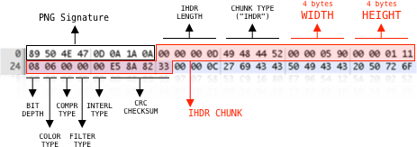
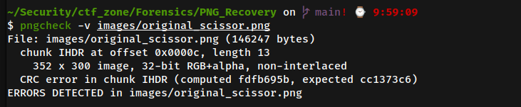
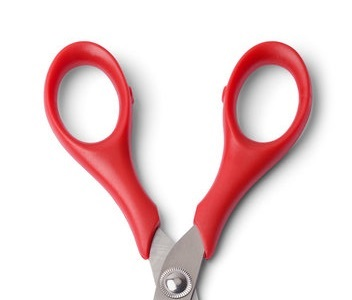

# PNG Recovery

Flag: ITMO{Cr0piNg_L1k3_mAster}

**File need to analyis**: 

*Description: "There's something wrong here. Maybe there aren't enough blades."*

## Analysis
- So basically, i need to take a look around this image. `eog <imgfile>` and result is failure 
- It talk about the image meet some `IHDR: CRC error`, so `CRC` is easily to understand this the way to render your image, if this wrong your Byte of image can not be rendered, Yup your image will corrupt and here is the documentation about `CRC`, more details take a look at [this link](https://www.w3.org/TR/PNG-Structure.html)

        A 4-byte CRC (Cyclic Redundancy Check) calculated on the 
        preceding bytes in the chunk, including the chunk type code and 
        chunk data fields, but not including the length field. The CRC 
        is always present, even for chunks containing no data.

- For helping you detection what wrong, if you have `Linux` or `WSL2` machine, take a look [`pngcheck tool`](http://www.libpng.org/pub/png/apps/pngcheck.html) - cool stuff for helping you understand what is wrong

- You can see the error talk about `IHDR` have CRC: error, so it will help you define what location wrong, and luckily `IHDR` is chunk which location after `PNG Signaruture` and here what you need to check 

- Turn back to `pngcheck -v <your_image>` to figure out what wrong this PNG

it talk you, the image has sth wrong inside CRC, so you can change that from `cc1373c6` to `fdfb695b` by any **hexeditor** which you have (e.x: Ghex, HxD) and so you will get this

--> That all kind you can have talk a look around this png, tools stuff like `steghide zsteg stegsolve exiftool strings binwalk` is not helpful in situation. So go to the `truth` part to identify the actually in last of tunnel

## Find the truth
When i look at the image, it make me relate about the old challenge i broke down with `JPEG` and need to recovery the image like this. Go to check it in [my blog](https://hackmd.io/4P64263mTyyMEgdkJq8X7w). And yeah i focus to resize but in `bytes` for situation, but i will split that for 2 circumstances, 1 the actually `CRC` is wrong or 2 the size of the image is wrong and `CRC` is good. So you need to take a look this kind

1. Solving like a guesser (`CRC` is wrong):
- This way is quite easily, so you can `pngcheck` to find what wrong in the image. So you need to expand your image to expected and use `pngcheck` for resolve the `CRC chunk error`
- Follow this image, i thinks the image wrong the heigh so you need to focus to 